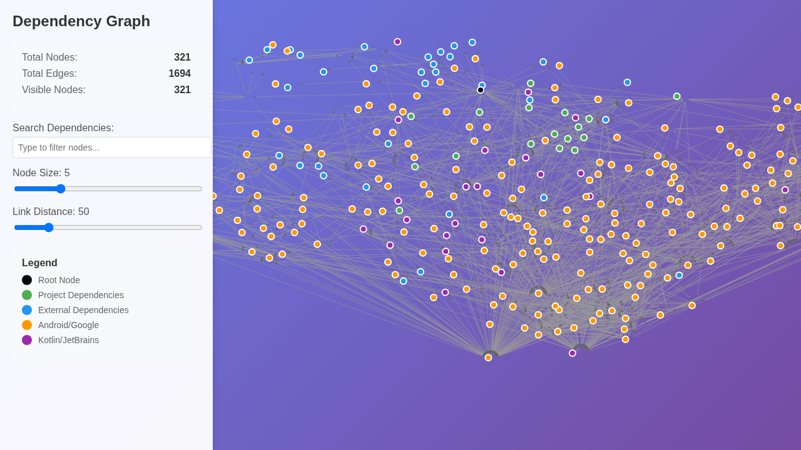
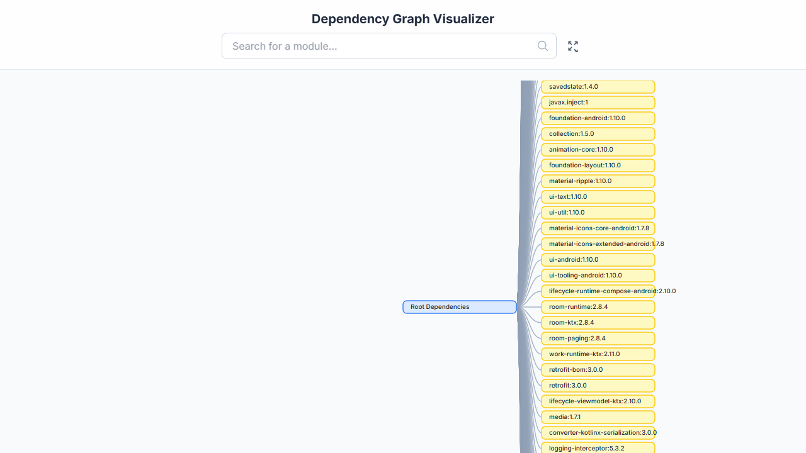

# Gradle Dependency Viewer

A powerful and intuitive tool to visualize Gradle dependencies as interactive graphs. **This tool requires the output of the Gradle `dependencies` task saved as a text file.**



## Getting Started

### Prerequisites

- Python 3.12 or higher
- [uv](https://github.com/astral-sh/uv) (recommended for dependency management)

### Running the Web Application

To start the server in development mode:

```bash
uv run uvicorn app.main:app --reload
```

Access the UI at [http://127.0.0.1:8000](http://127.0.0.1:8000).

## Usage Guide

### 1. Generate Dependency File
Run the following command in your Gradle project root to generate a text file of your dependencies.

**Note:** The configuration name (e.g., `debugRuntimeClasspath`) varies depending on your project's build variants and flavors. Check your available configurations by running `./gradlew app:dependencies` without arguments first to decide which one you want to visualize.

```bash
./gradlew app:dependencies --configuration debugRuntimeClasspath > my_app.txt
```

### 2. Upload and Visualize
1. Open the web app in your browser.
2. Drag and drop or click to upload your `my_app.txt`.
3. The app will automatically parse the file and redirect you to the visualization.

### 3. Navigation and Features
- **File History**: The landing page shows a history of uploaded files. You can revisit any previous visualization or delete old files.
- **Tree Viewer**: Provides a hierarchical view of dependencies, perfect for understanding the structure of your project.
  
- **Graph Viewer**: Offers a flexible, interactive neural graph visualization. Great for identifying complex relationship webs and transitive dependencies.
- **Search and Filter**: Both viewers support filtering. Enter a keyword (e.g., `androidx`, `:module-name`) to highlight matching nodes and their connections, making it easy to trace specific dependencies.

## Development

### Manual CLI Parsing (Optional)
While the web app handles parsing automatically, you can still use the core scripts manually:

```bash
uv run python app/parse.py path/to/my_app.txt
```
