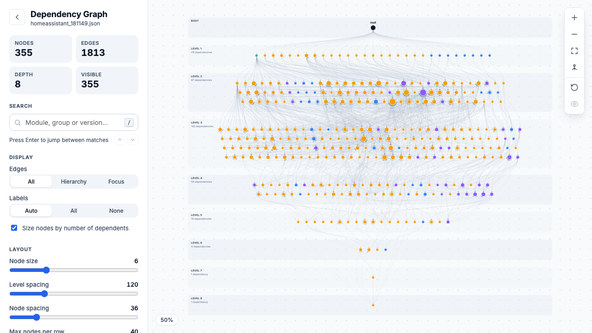
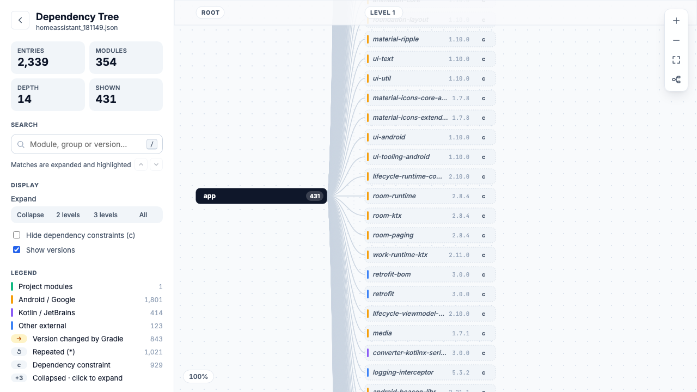

# Gradle Dependency Viewer

A powerful and intuitive tool to visualize Gradle dependencies as interactive graphs. **This tool requires the output of the Gradle `dependencies` task saved as a text file.**



## Getting Started

### Prerequisites

- Python 3.12 or higher
- [uv](https://github.com/astral-sh/uv) (recommended for dependency management)

### Running the Web Application

To start the server in development mode:

```bash
uv run uvicorn app.main:app --reload
```

Access the UI at [http://127.0.0.1:8000](http://127.0.0.1:8000).

## Usage Guide

### 1. Generate Dependency File
Run the following command in your Gradle project root to generate a text file of your dependencies.

**Note:** The configuration name (e.g., `debugRuntimeClasspath`) varies depending on your project's build variants and flavors. Check your available configurations by running `./gradlew app:dependencies` without arguments first to decide which one you want to visualize.

```bash
./gradlew app:dependencies --configuration debugRuntimeClasspath > my_app.txt
```

### 2. Upload and Visualize
1. Open the web app in your browser.
2. Drag and drop or click to upload your `my_app.txt`.
3. The app will automatically parse the file and redirect you to the visualization.

### 3. Navigation and Features
- **Pre-Compiled Open Source Projects**: The landing page lists ready-to-explore dependency trees of open source Android projects (from `app/static/sample/`), so you can try the viewers without uploading anything.
- **Stateless**: The app never stores your data. An uploaded TXT is parsed on the fly and the result is kept only in your browser tab (`sessionStorage`); closing the tab discards it.
- **Tree Viewer**: Provides a hierarchical view of dependencies, perfect for understanding the structure of your project.
  
- **Graph Viewer**: Offers a flexible, interactive neural graph visualization. Great for identifying complex relationship webs and transitive dependencies.
- **Search and Filter**: Both viewers support filtering. Enter a keyword (e.g., `androidx`, `:module-name`) to highlight matching nodes and their connections, making it easy to trace specific dependencies.

## Development

### Manual CLI Parsing (Optional)
While the web app handles parsing automatically, you can still use the core scripts manually:

```bash
uv run python app/parse.py path/to/my_app.txt
```

### Generating a Pre-Compiled Sample (Jenkins)
`jenkins/generate-sample.Jenkinsfile` turns a public GitHub Android repository into a new sample in `app/static/sample/` and opens a pull request with it. It downloads the repository archive, checks that it is an Android Gradle project with a wrapper, finds the app module and a release runtime classpath configuration, runs `./gradlew <module>:dependencies --configuration <configuration>`, converts the output to JSON, and deletes the downloaded project when it finishes. A new dump of a project replaces that project's older sample.

To set it up, create a Pipeline job ("Pipeline script from SCM") on this repository with the script path `jenkins/generate-sample.Jenkinsfile`, and add a "Username with password" credential with the ID `github-credentials` whose password is a GitHub token that can push branches and open pull requests (a non-dry run checks this before anything else runs). The agent needs `git`, `curl`, `unzip`, `python3` and Docker (with the Docker Pipeline plugin). Gradle runs inside `ANDROID_IMAGE`, because building a downloaded project runs its code.

| Parameter | Default | Purpose |
|---|---|---|
| `REPO_URL` | | e.g. `https://github.com/android/architecture-samples` |
| `GIT_REF` | `HEAD` | Branch, tag or commit |
| `SAMPLE_NAME` | repository name | Name shown on the home page |
| `MODULE` | detected | Gradle path of the app module, e.g. `:app` |
| `CONFIGURATION` | shortest `*ReleaseRuntimeClasspath` | Configuration to dump |
| `ANDROID_IMAGE` | `ghcr.io/cirruslabs/android-sdk:35` | Image with a JDK and the Android SDK (amd64 and arm64); `eclipse-temurin:17-jdk` is a smaller JDK-only choice that works with recent Android Gradle plugins; blank runs Gradle on the agent |
| `BASE_BRANCH` | `main` | Branch the pull request targets |
| `CACHE_GRADLE` | `true` | Keep Gradle's downloads on the agent between builds |
| `DRY_RUN` | `false` | Only build and archive the JSON |

Docker keeps `ANDROID_IMAGE` after the first pull, and with `CACHE_GRADLE` on, the Gradle distribution and dependencies stay in `~/.cache/gradle-dependency-viewer/gradle` on the agent, so only the first build of a project downloads everything. Builds run one at a time because they share that cache. To start over, delete the directory on the agent (and `docker rmi` the image to force a new pull).

The steps are in `jenkins/generate_sample.py` (standard library only), so you can run them locally too, e.g. `python3 jenkins/generate_sample.py validate path/to/project`.
