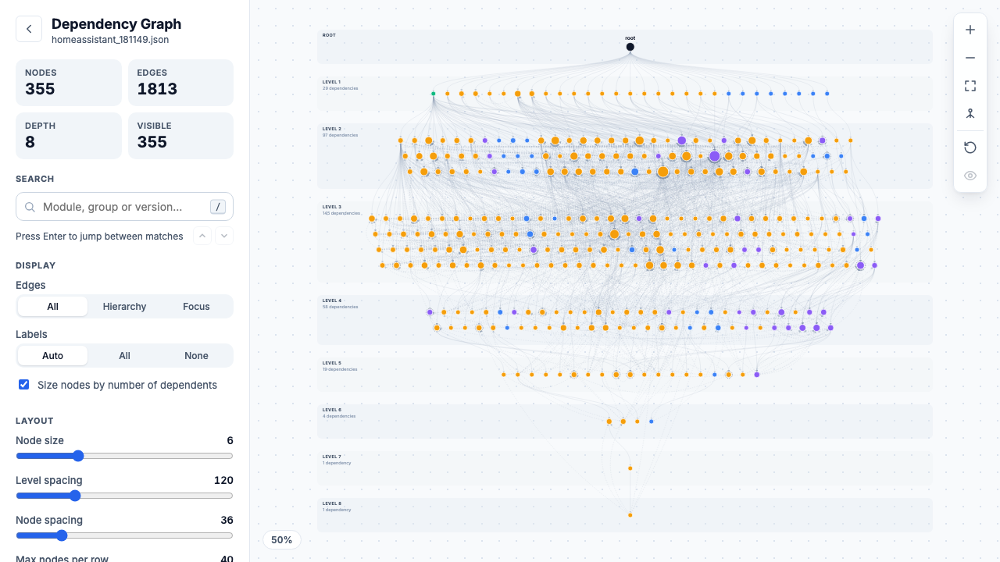
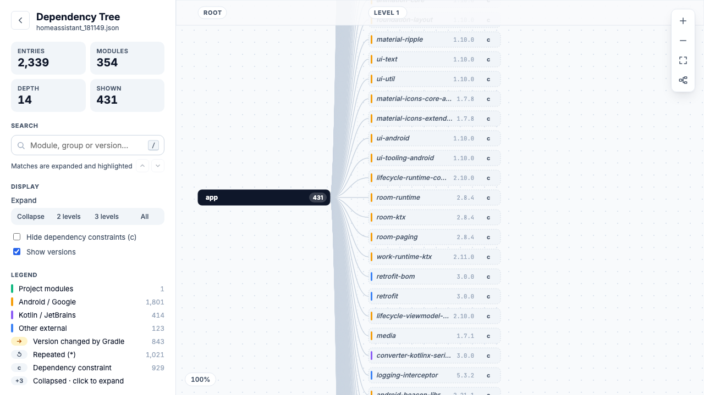

# Gradle Dependency Viewer

Visualize Gradle dependency reports as interactive graphs and trees. Upload the output of the Gradle `dependencies` task saved as a text file.

The backend uses Kotlin and Ktor. The parser, filters, graph conversion, summaries and dependency export live in the `core` Kotlin Multiplatform module, using the Kotlin standard library and `kotlinx.serialization`. The frontend keeps its static JavaScript, CSS and D3 7.9.0 UI.



## Getting started

### Prerequisites

- JDK 21 for development and CI. The Gradle wrapper is included.
- Node.js 22 to run the core tests on JavaScript.
- Python 3.12 and [uv](https://github.com/astral-sh/uv) only for browser tests and Jenkins automation.

### Running the web application

To start the server in development mode:

```bash
./gradlew :server:run
```

Access the UI at [http://127.0.0.1:8000](http://127.0.0.1:8000).

## Usage Guide

### 1. Generate Dependency File
Run the following command in your Gradle project root to generate a text file of your dependencies.

**Note:** The configuration name (e.g., `debugRuntimeClasspath`) varies depending on your project's build variants and flavors. Check your available configurations by running `./gradlew app:dependencies` without arguments first to decide which one you want to visualize.

```bash
./gradlew app:dependencies --configuration debugRuntimeClasspath > my_app.txt
```

### 2. Upload and Visualize
1. Open the web app in your browser.
2. Drag and drop or click to upload your `my_app.txt`.
3. The app will automatically parse the file and redirect you to the visualization.

### 3. Navigation and Features
- **Pre-Compiled Open Source Projects**: The landing page lists ready-to-explore dependency trees of open source Android projects (from `app/static/sample/`), so you can try the viewers without uploading anything.
- **Stateless**: The app never stores your data. An uploaded TXT is parsed on the fly and the result is kept only in your browser tab (`sessionStorage`); closing the tab discards it.
- **Tree Viewer**: Provides a hierarchical view of dependencies, perfect for understanding the structure of your project.
  
- **Graph Viewer**: Offers a flexible, interactive neural graph visualization. Great for identifying complex relationship webs and transitive dependencies.
- **Search and Filter**: Both viewers support filtering. Enter a keyword (e.g., `androidx`, `:module-name`) to highlight matching nodes and their connections, making it easy to trace specific dependencies.

## Development

### Build, test and CLI

```bash
./gradlew :core:allTests :server:test :server:installDist
uv sync --frozen --dev
uv run playwright install chromium
uv run pytest
```

`core` declares JVM and JavaScript targets. Its shared logic and tests live in `commonMain` and `commonTest`. `server` contains the Ktor host and JVM file and charset handling. No Kotlin frontend bundle replaces the existing JavaScript.

The installed distribution can run the server or the CLI, without Gradle:

```bash
server/build/install/gradle-dependency-viewer/bin/gradle-dependency-viewer
server/build/install/gradle-dependency-viewer/bin/gradle-dependency-viewer parse my_app.txt --output my_app.json
server/build/install/gradle-dependency-viewer/bin/gradle-dependency-viewer tree my_app.json --filter androidx --output filtered.json
server/build/install/gradle-dependency-viewer/bin/gradle-dependency-viewer tree my_app.json --project-only
server/build/install/gradle-dependency-viewer/bin/gradle-dependency-viewer graph my_app.json --distance 2 --exclude kotlin --output graph.json
server/build/install/gradle-dependency-viewer/bin/gradle-dependency-viewer enlist my_app.json --output dependencies.yaml
```

CLI commands print to stdout unless `--output` is supplied. `summary FILE` prints entry counts and validated sample metadata as JSON.

### Docker and deployment

```bash
docker build -t gradle-dependency-viewer .
docker run --rm -p 8000:8000 gradle-dependency-viewer
```

Docker builds and tests the JVM code, then copies the installed distribution into a Temurin 21 JRE image. It runs as UID 10001 and checks `/healthz`. Static assets and samples are packaged in the application resources. The server remains stateless and needs no data volume.

The tag-triggered workflow still publishes to GHCR and replaces the container over SSH. It now runs Kotlin tests before publishing and waits for the replacement container to become healthy. The release version lives in `gradle.properties`. `python3 scripts/up_version.py` bumps it, commits, tags and pushes the release as before.

### Transition from the Python backend

- Keep port 8000, the existing proxy routes, GHCR image name and SSH secrets. No deployment credential changes are required.
- For a source-based installation, replace the Uvicorn command with `./gradlew :server:run` or the installed distribution command above. Install JDK 21 on development and Jenkins agents. The Docker host needs no Java installation.
- Keep Python on the Jenkins agent for repository, icon and GitHub automation. The pipeline now builds the Kotlin CLI before generating samples. Local `convert` and `open-pr` commands also require `./gradlew :server:installDist`; `VIEWER_CLI` can point to another installed distribution.
- Rebuild and restart after changing bundled samples or frontend files. The container uses packaged resources rather than a live source directory. CSS and JS URLs retain content hashes for cache invalidation.
- Ktor uses a 50 MiB multipart file limit. If you upload larger reports, adjust `receiveMultipart` in `Main.kt` and any reverse proxy upload limit together.
- The image uses `JAVA_OPTS` with `MaxRAMPercentage=75.0`. If your host limits container memory, check JVM usage during the first rollout and tune the container limit or `JAVA_OPTS` for that host. Keep the previous image tag available for rollback.
- Browser upload storage keys and API response structures remain compatible. No saved server-side data needs migration.


### Generating a Pre-Compiled Sample (Jenkins)
`jenkins/generate-sample.Jenkinsfile` turns a public GitHub Android repository into a new sample in `app/static/sample/` and opens a pull request with it. It checks out the commit with git (without history, since some builds run git while Gradle configures them), checks that it is a Gradle project with a wrapper, works out the Gradle command to run (or takes it from `GRADLE_COMMAND`), runs it, converts the output to JSON, and deletes the downloaded project when it finishes. The sample's `meta` entry records the source repository and commit, and the app's launcher icon (a PNG or WebP bitmap from the app module, when it has one); the home page shows them with the sample. A new dump of a project replaces that project's older sample.

To set it up, create a Pipeline job ("Pipeline script from SCM") on this repository with the script path `jenkins/generate-sample.Jenkinsfile`, and add a "Username with password" credential with the ID `github-credentials` whose password is a GitHub token that can push branches and open pull requests (a non-dry run checks this before anything else runs). The job runs on the agent labelled `self` (an x86 machine), which needs `git`, `python3`, a JDK (21 or newer) and the [Antigravity](https://antigravity.google) CLI at `/home/fajar/.local/bin/agy` (the `AGY` variable in the Jenkinsfile), signed in for non-interactive use. Gradle runs directly on the agent, without Docker; the Android SDK is optional, because recent Android Gradle plugins can dump dependencies without it. Building a downloaded project runs its code as the Jenkins user, so use an agent you are comfortable running untrusted builds on.

| Parameter | Default | Purpose |
|---|---|---|
| `REPO_URL` | | e.g. `https://github.com/android/architecture-samples` |
| `GIT_REF` | `HEAD` | Branch, tag or commit |
| `SAMPLE_NAME` | repository name | Name shown on the home page |
| `GRADLE_COMMAND` | worked out from the Gradle files | Command whose output becomes the sample, e.g. `./gradlew app:dependencies --configuration debugRuntimeClasspath`. It must start with `./gradlew` and runs without a shell, so no redirects or pipes |
| `BASE_BRANCH` | `main` | Branch the pull request targets |
| `CACHE_GRADLE` | `true` | Keep Gradle's downloads on the agent between builds |
| `DRY_RUN` | `false` | Only build and archive the JSON |

With `CACHE_GRADLE` on, the Gradle distribution and dependencies stay in `~/.cache/gradle-dependency-viewer/gradle` on the agent, so only the first build of a project downloads everything. Builds run one at a time because they share that cache. To start over, delete that directory on the agent.

When `GRADLE_COMMAND` is blank, the job sends the project's Gradle files (`settings.gradle(.kts)`, `build.gradle(.kts)`, `gradle.properties`) to the Antigravity CLI and asks which module and debug runtime classpath configuration to dump, so no Gradle run is needed to find them. The CLI gets no tools and cannot run commands; its answer must still be a `./gradlew` command or the build fails. If it answers `UNKNOWN`, the build stops and names the reason, and you can re-run it with `GRADLE_COMMAND` set.

The orchestration steps are in `jenkins/generate_sample.py` and use the Python standard library. Parsing and summaries call the Kotlin CLI. Build it with `./gradlew :server:installDist` before running `convert` or `open-pr` locally. Repository inspection still works directly, for example `python3 jenkins/generate_sample.py validate path/to/project`.
